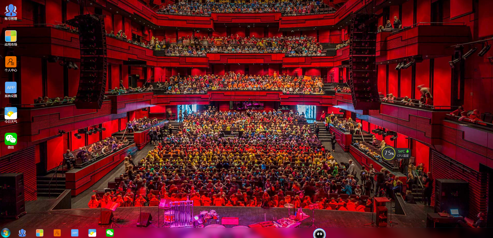
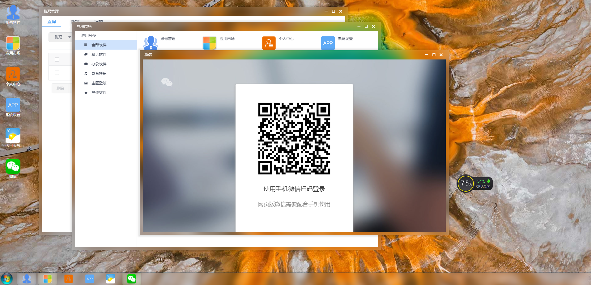
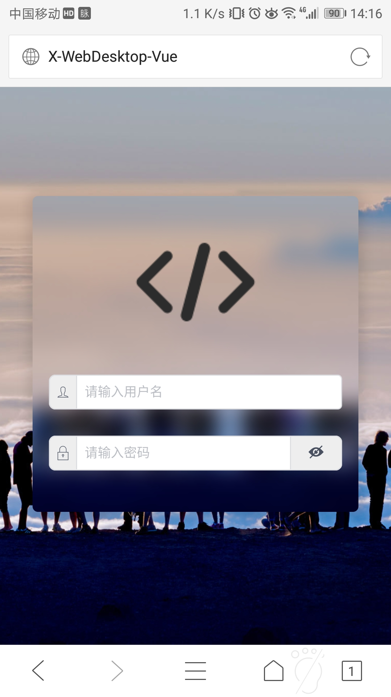
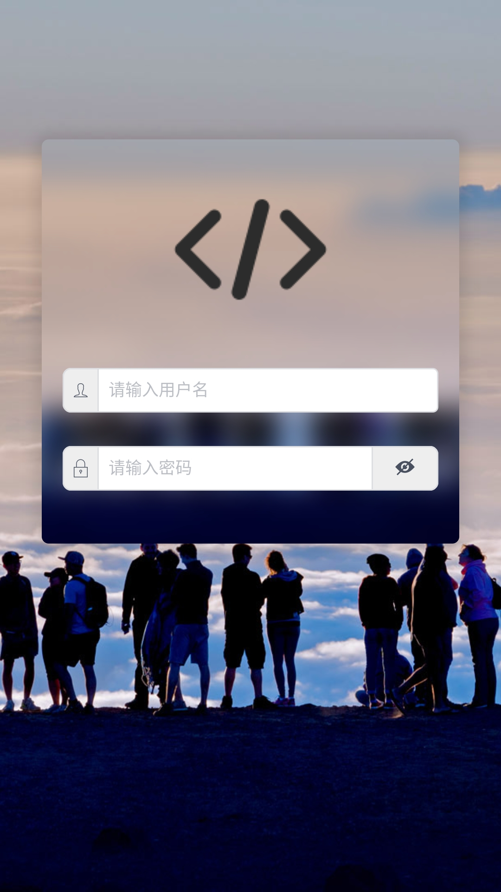
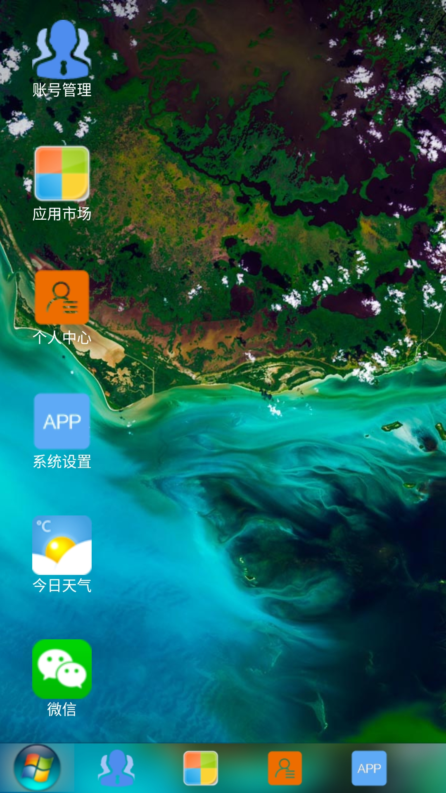
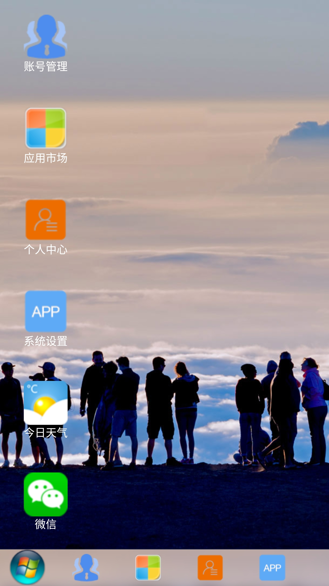
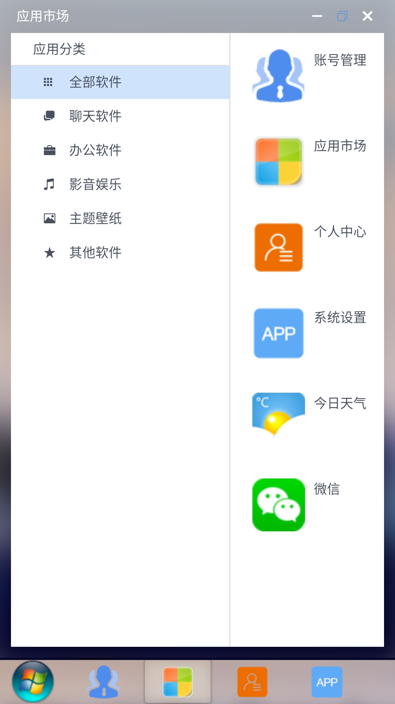
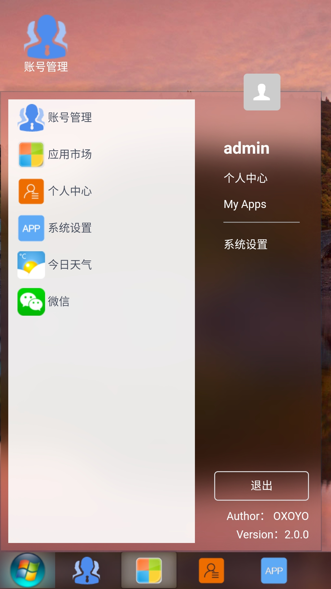
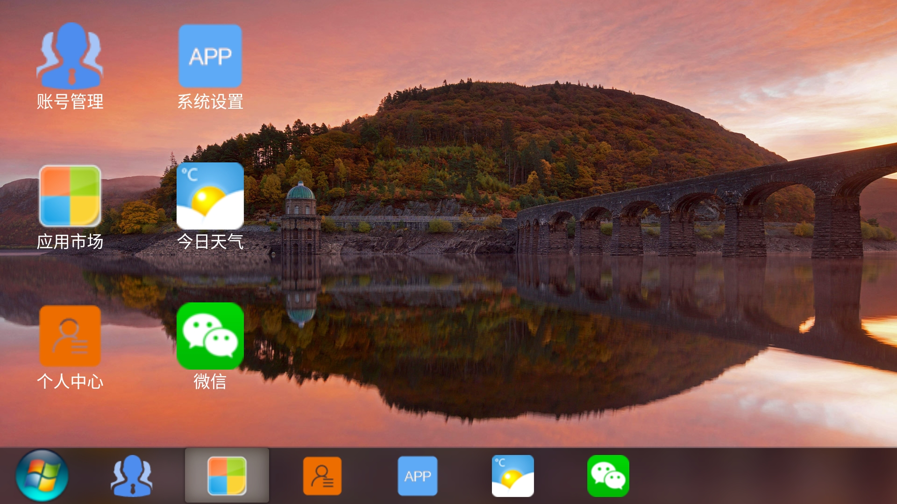

# X-WebDesktop-Vue

Version: 2.0.0 【开发中...】

基于 Vue 的 WebDesktop 系统

# Version

| FrontEnd | API |
| :-------- | :-------- |
| [2.0.0](https://github.com/OXOYO/X-WebDesktop-Vue/tree/master) | [2.0.0](https://github.com/OXOYO/X-WebDesktop-Api-Koa/tree/master) |
| [1.0.1](https://github.com/OXOYO/X-WebDesktop-Vue/tree/1.0.1) | [1.0.1](https://github.com/OXOYO/X-WebDesktop-Api-Koa/tree/1.0.1) |
| [1.0.0](https://github.com/OXOYO/X-Desktop-Vue/tree/master) | - |

## Documentation

[中文文档 (2.0.0)](./document/md/guide_cn_v2.0.0.md)

## Start

```bash
  git clone
  npm i
  npm run dev
```

## Build

```bash
  npm run build
```

## Preview

  **Url**：[https://oxoyo.github.io/X-WebDesktop-Vue/](https://oxoyo.github.io/X-WebDesktop-Vue/)

  **Account**：`admin`

  **Password**：`123456`

## Screenshot

### PC








### Mobile










## 目录结构
```bash
  \_ src
    \_ platform                 // 【平台】
      \_ apps                   // 平台默认应用
        \_ Admin                // 后台容器
          \_ components         // 组件
          \_ containers         // 容器
          \_ pages              // 页面
          \_ store              // Store
          \_ api.js             // 接口
          \_ config.js          // 配置文件
          \_ Index.vue          // 入口组件
          \_ openApi.js         // 对外接口
          \_ contextMenu.js     // 右键菜单配置
        \_ ContextMenu          // 右键菜单
        \_ Desktop              // 桌面
        \_ DesktopIcon          // 桌面图标
        \_ DekstopWidget        // 桌面控件
        \_ Home                 // 前台容器
        \_ Login                // 前台登录
        \_ StartMenu            // 开始菜单
        \_ TaskBar              // 任务栏
        \_ TaskBarIcon          // 任务栏图标
        \_ TaskBarWidget        // 任务栏控件
        \_ Window               // 应用窗口
      \_ store                  // 平台Store
      \_ config.js              // 平台配置
      \_ Index.vue              // 平台入口文件
    \_ apps                     // 【用户应用】
      \_ DemoApp001             // 应用 DemoApp001
        \_ components           // 组件
        \_ containers           // 容器
        \_ pages                // 页面
        \_ store                // Store
        \_ api.js               // 接口
        \_ config.js            // 配置文件
        \_ Index.vue            // 入口文件
        \_ openApi.js           // 对外接口
        \_ contextMenu.js       // 右键菜单配置
    \_ App.vue                  // 根入口组件
    \_ config.js                // 根配置信息
    \_ main.js                  // 跟入口js
```

## TODO
1.架构调整，需重构，应用设计更合理。
2.优化系统性能。
3.编写开发指南。
